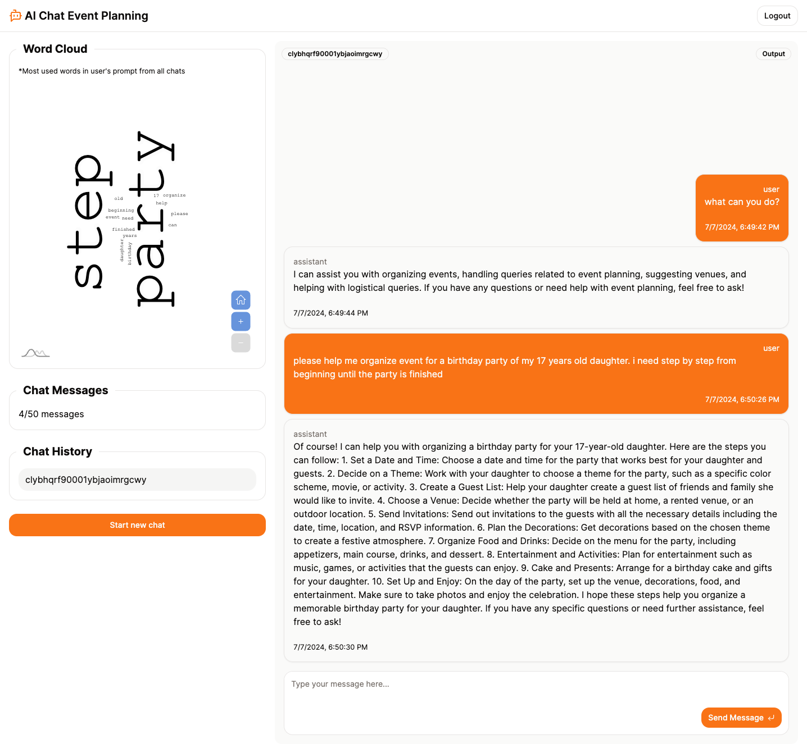
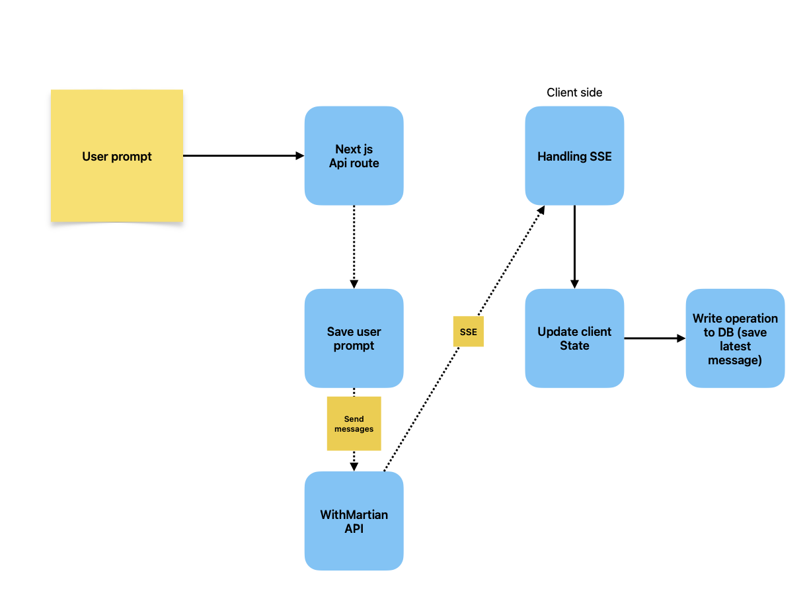
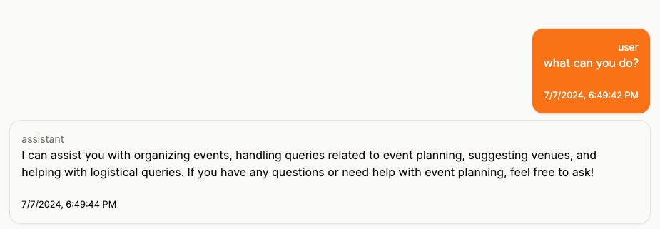
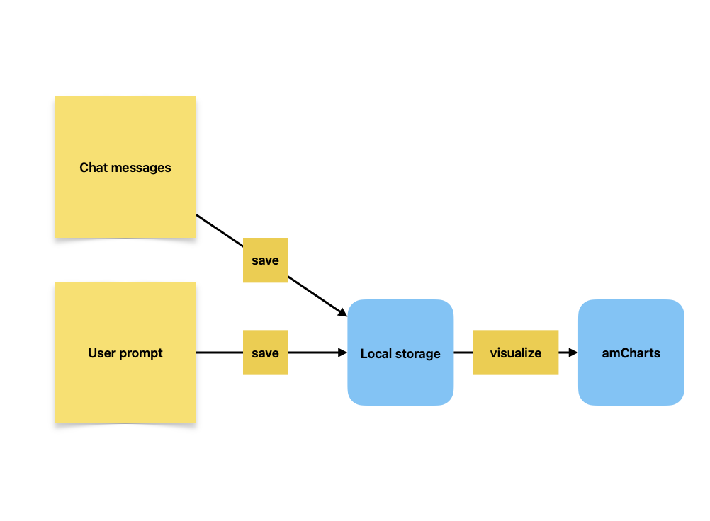

# AI Chat Event Planning



## Tech Stack
- withmartian
- nextjs 14 app router
- typescript
- tailwindcss
- shadcn/ui
- prisma
- supabase for auth and database
- langchain
- openai
- vercel for hosting

## Project structure

- app (next js route)
- components (reusable layout and ui)
- config (static hard coded data)
- hoc (higher order component)
- hooks (custom hooks to store module's logic)
- lib (third party library that customized for our use case)
- modules (application module based on feature)
- services (api call separated by module)
- types.ts file (typescript type definition)
- store.ts file (global client state management)

## Database Model

```prisma
model Chat {
  id        String   @id @default(cuid())
  name      String?
  messages  Json[]
  userId    String
  createdAt DateTime @default(now())
  updatedAt DateTime @updatedAt
}
```

### Consideration

We are using supabase for user authentication. Supabase returning user id when user sign up or sign in. We are using this user id to create chat.

We aim to be simple as possible in this project by using only single Chat table instead creating another user table since sign up user already handled by supabase.

The Json structure for messages will be defined in frontend as a typescript interface. The interface is as follows:

```ts
interface Messages {
  type: "assistant" | "user";
  content: string;
  createdAt: Date;
}
```

## Screens

There are three screens (pages) in this project.

1. Login (/login) -> Public
2. OTP (/otp) -> Public with rule
3. Chat (/chat) -> Protected

### Consideration

Login will also a signup page. If user not yet registered on supabase (first time user), then it will create a new user, if not it will sign in the user. Both scenario will required user to verify the otp that it will be sent to their email address.

OTP page will have a rule which is can only be used by user if the user already request for OTP in the login page (submit email address).

Chat will be protected and the redirection will be handled on server side to check if user is authenticated or not. If user is not authenticated, then it will redirect to login page.

## REST Api Endpoint

1. GET /chats -> Get all user's chat

```ts
// Request
{
  userId: string;
}
```

```ts
// Response
[
  {
    id: string
    name: string
    messages: Messages[]
    userId: string
    createdAt: Date
    updatedAt: Date
  }
]
```

2. POST /chats -> Create a new chat

```ts
// Request
{
  userId: string;
}
```

3. GET /chats/:id -> Get a chat by id

```ts
// Request
{
  chatId: string;
}
```

4. POST /chats/message -> save user message to a chat

```ts
// Request
{
  chatId: string;
  message: string;
  role: "user" | "assistant";
}
```

5. PUT /chats/message -> save assistant message to a chat

```ts
// Request
{
  chatId: string;
  messages: ChatMessageItem[];
  latestMessage: string;
}
```

## Chatbot

We will be using langchain prompt template to help us translate user input and parameters into instructions for a language model.

### System design overview



We will send every messages (user prompt, LLM response) to the WithMartian API so the LLM can know the previous context of the conversation.

### Consideration

User can insert any input that is not related to event planning. We need to handle this case.

### Approach

**Criteria**

1. Query handling
2. Venue suggestion
3. Logistical query handling

We will be using system prompt to the LLM to act as an event planner and only respond to the user's query that is related to event planning.

By using this approach, the LLM will not adhere to unrelated user queries and will ask the user about 3 criteria above that is related to event planning and provide response based on the criteria.

For example, if user ask about what the chatbot can do, it will response with the following:



**Database Handling**

We are use SSE (Server Sent Event) and saved to database at the end of finished streamed message.

**Pros**

- only the latest streamed message will be saved to database, if there is no error during streaming.

**Cons**

- if there is error, the message will not be saved to database.

**Limitation**

We are not handling case when user reload page or change to another chat item when streamed message still in progress or error happened. In this case, the database will only save the latest streamed message.

## Word Cloud

We will be using word cloud to visualize the most common words the user used in their prompts.

### Approach

